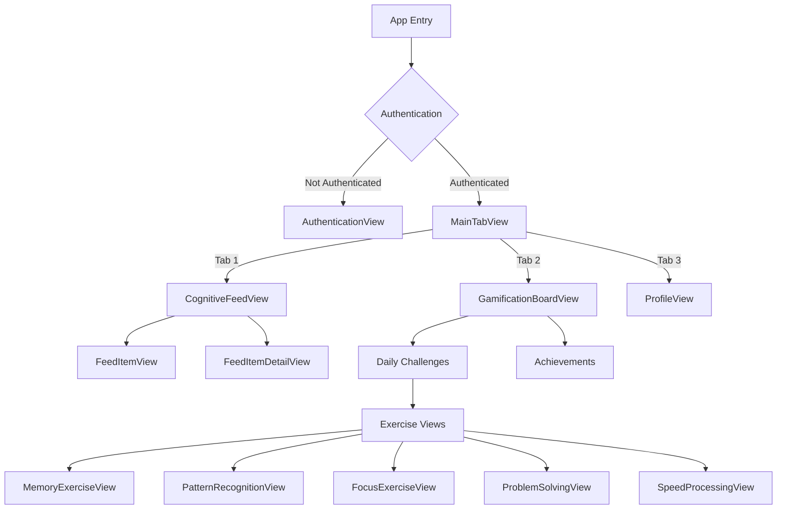
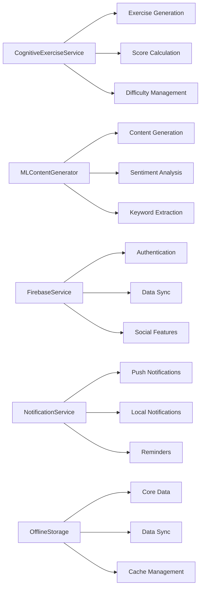
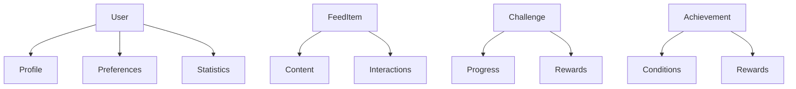

# Attntiv App Structure

## Navigation Flow


## Core Features

### Authentication
- Sign In/Sign Up
- Email authentication
- Profile creation

### Cognitive Feed
- TikTok-style vertical scrolling
- AI-generated content
- Like and share functionality
- Offline support

### Gamification
- Daily challenges
- Achievement system
- Points and streaks
- Progress tracking

### Exercise Types
1. **Memory Training**
   - Sequence recall
   - Pattern memorization
   - Adaptive difficulty

2. **Pattern Recognition**
   - Visual patterns
   - Number sequences
   - Multiple choice answers

3. **Focus Training**
   - N-Back challenges
   - Concentration exercises
   - Time-based scoring

4. **Problem Solving**
   - Math problems
   - Logic puzzles
   - Time bonuses

5. **Speed Processing**
   - Visual processing
   - Quick decision making
   - Reaction time tracking

## Services

### Core Services


## UI Components

### Common Components
- ScoreView
- StreakView
- TimerView
- ResultsOverlay
- CountdownOverlay

### Theme Colors
- Primary: Purple (#9966FA)
- Background: Dark (#141414)
- Accent colors for different exercise types

## Data Models

### Core Models


## File Structure
```
Attntiv/
├── App/
│   ├── AttntivApp.swift
│   └── ContentView.swift
├── Features/
│   ├── Authentication/
│   ├── Feed/
│   ├── Gamification/
│   ├── Exercises/
│   └── Profile/
├── Core/
│   ├── Services/
│   ├── Models/
│   └── Utils/
└── Resources/
    ├── Assets.xcassets
    └── AttntivData.xcdatamodeld
``` 